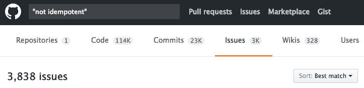
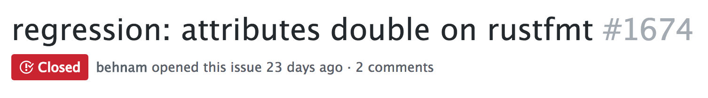
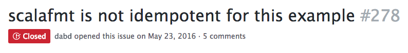
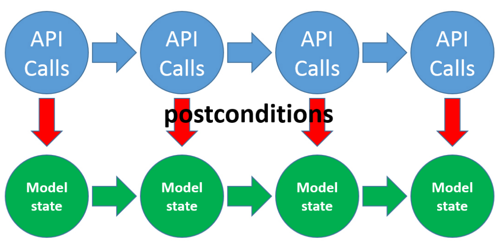

class: center, bottom, heading-black
background-image: url(images/example-based.jpeg)

# Finding More Bugs With Less Effort

## @charlesofarrell

???

- Property-based testing is our default
- We have a majority of property-based tests

---

class: center, bottom, heading-black
background-image: url("images/chopsticks.jpg")

## @charlesofarrell

???

- Property-based testing is our default
- We have a majority of property-based tests


---

class: center, middle, heading-black
background-image: url(images/goal.jpeg)

## Motivation?

???

- Safety
- At Ambiata it costs $$$

---

class: center, middle, heading-black
background-image: url(images/example-based.jpeg)

## Example-based Testing

---

class: code

```scala
def substring(s: String, i: Int): String
```

---

class: code

```scala
def substring(s: String, i: Int): String

def testSubstring = {
  substring("abc", 1) == "bc"
}
```

---

class: code

```scala
def substring(s: String, i: Int): String

def testSubstring = {
  substring("abc", 1) == "bc"
  substring("abc", 3) == ""
}
```

---

class: code

```scala
def substring(s: String, i: Int): String

def testSubstring = {
  substring("abc", 1) == "bc"
  substring("abc", 3) == ""
  substring("abc", 4) == ???
}
```

---

class: code

```scala
def substring(s: String, i: Int): String

def testSubstring = {
  substring("abc", 1) == "bc"
  substring("abc", 3) == ""
  substring("abc", 4) == ???
  substring("abc", -1) == ???
}
```

---

class: middle, center


---

class: middle, center


???

- Year 2000!

---

class: middle


---

class: middle


---


http://www.quviq.com/volvo-quickcheck/

---


http://www.quviq.com/volvo-quickcheck/

- 3,000 pages of specifications
- 20,000 lines of QuickCheck
- 1,000,000 LOC, 6 suppliers
- 200 problems
- 100 problems in the standard

---

## https://jepsen.io/

- MongoDB
- Cassandra
- RabbitMQ
- Redis
- Riak
- Zookeeper
- VoltDB
- RethinkDB
- Elasticsearch

---

class: middle, center

### https://en.wikipedia.org/wiki/QuickCheck

> 31 Languages


---

class: top, left, heading-black
background-image: url(images/fuzzy.jpg)

## Fuzzing

---

class: code

```scala
def substring(s: String, i: Int): String

def testSubstring =


    substring("abc", 1) == "bc"
```

---

class: code

<pre><code class="scala scala-fg">def substring(s: String, i: Int): String

def testSubstring =


    substring("abc", 1)
</code></pre>

```scala-bg


    substring("abc", 1) == "bc"
```

---

class: code

```scala
def substring(s: String, i: Int): String

def testSubstring =


    substring("abc", 1)
```

---

class: code

```scala-fg


  generateString      s


              s
```

```scala-bg
def substring(s: String, i: Int): String

def testSubstring =
  generateString    { s =>


    substring(s, 1)
  }
```

---

class: code

<pre><code class="scala scala-fg">&nbsp;


  forAll(         )


def forAll[A](Gen[A], A => Prop): Prop
</code></pre>

```scala-bg
def substring(s: String, i: Int): String

def testSubstring =
  forAll(genString) { s =>


    substring(s, 1)
  }

def forAll[A](Gen[A], A => Prop): Prop
```

---

class: code

<pre><code class="scala scala-fg">&nbsp;


         genString


def genString: Gen[String]
</code></pre>

```scala-bg
def substring(s: String, i: Int): String

def testSubstring =
  forAll(genString) { s =>


    substring(s, 1)
  }

def forAll[A](Gen[A], A => Prop): Prop

def genString: Gen[String]
```

---

class: code

```scala-fg


         genInt    i

                 i


def genInt: Gen[Int]
```

```scala-bg
def substring(s: String, i: Int): String

def testSubstring =
  forAll(genString) { s =>
  forAll(genInt) { i =>

    substring(s, i)
  }}

def forAll[A](Gen[A], A => Prop): Prop

def genString: Gen[String]

def genInt: Gen[Int]
```

---

class: code

<pre><code class="scala scala-fg">&nbsp;

def testSubstring =
  forAll(genString) { s =>
  forAll(genInt) { i =>

    substring(s, i)
  }}
</code></pre>

```scala-bg
def substring(s: String, i: Int): String

def testSubstring =
  forAll(genString) { s =>
  forAll(genInt) { i =>

    substring(s, i)
  }}
```

---

class: code


```scala
def substring(s: String, i: Int): String

def testSubstring =
  forAll(genString) { s =>
  forAll(genInt) { i =>

    substring(s, i)
  }}
```

<pre><code class="warning">
! testSubstring: StringIndexOutOfBoundsException
    String index out of range: 0
> ARG_0: ""
> ARG_1: 0
</code></pre>

---

class: code

<pre><code class="scala scala-fg">&nbsp;


  i &lt; s.length ==>


def ==>(p: Boolean, Prop): Prop
</code></pre>

```scala-bg
def substring(s: String, i: Int): String

def testSubstring =
  forAll(genString) { s =>
  forAll(genInt) { i =>
  i < s.length ==>
    substring(s, i)
  }}

def ==>(p: Boolean, Prop): Prop
```

---

class: code

```scala
def substring(s: String, i: Int): String

def testSubstring =
  forAll(genString) { s =>
  forAll(genInt) { i =>
  i < s.length ==>
    substring(s, i)
  }}
```

<pre><code class="warning">
! testSubstring: StringIndexOutOfBoundsException
    String index out of range: -1
> ARG_0: ""
> ARG_1: -1
</code></pre>

---

class: code

```scala
def substring(s: String, i: Int): String

def testSubstring =
  forAll(genString) { s =>
  forAll(genInt) { i =>
  i >= 0 && i < s.length ==>
    substring(s, i)
  }}
```

---

class: code

```scala
def substring(s: String, i: Int): String

def testSubstring =
  forAll(genString) { s =>
  forAll(genInt) { i =>
  i >= 0 && i < s.length ==>
    substring(s, i)
  }}
```

<pre><code class="success">
+ HelloWorld.substring: OK, passed 100 tests.
</code></pre>

---

class: code

<pre><code class="scala scala-fg">&nbsp;


    substring(s, i) == ???
</code></pre>

```scala-bg
def substring(s: String, i: Int): String

def testSubstring =
  forAll(genString) { s =>
  forAll(genInt) { i =>
  i >= 0 && i < s.length ==>
    substring(s, i) == ???
  }}
```


---

class: center


???

- Patterns
- Not just writing list sorting functions
- Can be hard to get started


---

class: middle, center

## Round-trip


---

class: code

```scala
def toBytes(s: String): Array[Byte]

def fromBytes(b: Array[Bytes]): String
```

---

class: code

<pre><code class="scala scala-fg">&nbsp;


forAll(genString) { s =>
  val b = toBytes(s)
  fromBytes(b) == s
}
</code></pre>

```scala-bg
def toBytes(s: String): Array[Byte]

def fromBytes(b: Array[Bytes]): String


forAll(genString) { s =>
  val b = toBytes(s)
  fromBytes(b) == s
}
```

---

class: code

<pre><code class="scala scala-fg">&nbsp;


forAll(genString) { s =>
  val b = toBytes(s)
  fromBytes(b) == s
}
</code></pre>

```scala-bg
def toBytes(s: String): Array[Byte]

def fromBytes(b: Array[Bytes]): String


forAll(genString) { s =>
  val b = toBytes(s)
  fromBytes(b) == s
}
```

<pre><code class="warning">"돪" != "?"

> ARG_0: "돪"
</code></pre>

---

class: code

<pre><code class="scala scala-fg">                       c: Charset


                    c: Charset


       genCharset
</code></pre>

```scala-bg
def toBytes(s: String, c: Charset): Array[Byte]

def fromBytes
  (b: Array[Bytes], c: Charset): String

forAll(genString) { s =>
forAll(genCharset) { c =>
  val b = toBytes(s, c)
  fromBytes(b, c) == s
}}
```

---

class: code

<pre><code class="scala scala-fg">                       c: Charset


                    c: Charset


       genCharset
</code></pre>

```scala-bg
def toBytes(s: String, c: Charset): Array[Byte]

def fromBytes
  (b: Array[Bytes], c: Charset): String

forAll(genString) { s =>
forAll(genCharset) { c =>
  val b = toBytes(s, c)
  fromBytes(b, c) == s
}}
```

<pre><code class="warning">"돪" != "?"

> ARG_0: "돪"
> ARG_1: windows-1252
</code></pre>
---

class: code

```scala
import org.joda.time._


forAll(genDateTime) { dt =>

  val formatter = DateTimeFormat.fullDateTime()

  val s = formatter.print(dt)
  formatter.parseDateTime(s) == dt
}
```

???

- Symmetrical

---

class: code

```scala
import org.joda.time._


forAll(genDateTime) { dt =>

  val formatter = DateTimeFormat.fullDateTime()

  val s = formatter.print(dt)
  formatter.parseDateTime(s) == dt
}
```

<pre><code class="warning">Invalid format:
"Sunday, September 22, 2148 9:08:08 PM ART"
is malformed at "ART"
</code></pre>


---

class: code

```scala
def toJson(user: User): Json

def fromJson(json: Json): Option[User]

forAll(genUser) { user =>
  val json = toJson(user)
  fromJson(json) == Some(user)
}
```

---

class: code

```scala
def toJson(user: User): Json

def fromJson(json: Json): Option[User]

forAll(genUser) { user =>
  val json = toJson(user)
  fromJson(json) == Some(user)
}
```

<pre><code class="warning">
2015-01-01T12:57:39.123456
  != 2015-01-01T12:57:39.123
</code></pre>

???

- https://github.com/bos/aeson/issues/240
- Output UTCTime to microsecond precision

---

class: code

```scala
def insertUser(u: User): UserId

def getUser(u: UserId): Option[User]
```

---

class: code

```scala
def insertUser(u: User): UserId

def getUser(u: UserId): Option[User]


forAll(genUser) { user =>

  val id = insertUser(user)
  getUser(id) == Some(user)
}
```

---

class: code

```scala
def insertUser(u: User): UserId

def getUser(u: UserId): Option[User]


forAll(genUser) { user =>

  val id = insertUser(user)
  getUser(id) == Some(user)
}
```

<pre><code class="warning">Some(User(\NULL)) != Some(User())
</code></pre>


---

class: middle, center

## Test Oracle


---

class: code

```scala
def timSort(l: List[Int]): List[Int]
```

---

class: code

```scala
def timSort(l: List[Int]): List[Int]


forAll(genList(genInt)) { l =>

  timSort(l) == bubbleSort(l)
}
```

---

class: code

```scala
def timSort(l: List[Int]): List[Int]


forAll(genList(genInt)) { l =>

  timSort(l) == bubbleSort(l)
}
```

<pre><code class="warning">
https://bugs.openjdk.java.net/browse/JDK-8072909

TimSort fails with ArrayIndexOutOfBounds
on worst case long arrays
</code></pre>

---

class: code

```scala
def touchFile(file: File)

def listFiles: List[File]
```

---

class: code

<pre><code class="scala scala-fg">&nbsp;


forAll(genList(genFile)) { files =>

  files.foreach(f => touchFile(f))

  listFiles == files
}
</code></pre>

```scala-bg
def touchFile(file: File)

def listFiles: List[File]

forAll(genList(genFile)) { files =>

  files.foreach(f => touchFile(f))

  listFiles == files
}
```

---

class: code

<pre><code class="scala scala-fg">&nbsp;


forAll(genList(genFile)) { files =>

  files.foreach(f => touchFile(f))

  listFiles == files
}
</code></pre>

```scala-bg
def touchFile(file: File)

def listFiles: List[File]

forAll(genList(genFile)) { files =>

  files.foreach(f => touchFile(f))

  listFiles == files
}
```

<pre><code class="warning">
List("a", "A") != List("a")
> ARG_1: List("a", "A")
</code></pre>

---

class: code

```scala
def listUsersSortByName: List[User] =
  "SELECT * FROM user ORDER BY name ASC"
```

---

class: code

<pre><code class="scala scala-fg">&nbsp;


forAll(genList(genUser)) { users =>

  users.foreach(u => insertUser(u))

  listUsersSortByName ==
    users.sortBy(_.name.toLowerCase)
}
</code></pre>

```scala-bg
def listUsersSortByName: List[User] =
  "SELECT * FROM user ORDER BY name ASC"

forAll(genList(genUser)) { users =>

  users.foreach(u => insertUser(u))

  listUsersSortByName ==
    users.sortBy(_.name.toLowerCase)
}
```

---

class: code

<pre><code class="scala scala-fg">&nbsp;


forAll(genList(genUser)) { users =>

  users.foreach(u => insertUser(u))

  listUsersSortByName ==
    users.sortBy(_.name.toLowerCase)
}
</code></pre>

```scala-bg
def listUsersSortByName: List[User] =
  "SELECT * FROM user ORDER BY name ASC"

forAll(genList(genUser)) { users =>

  users.foreach(u => insertUser(u))

  listUsersSortByName ==
    users.sortBy(_.name.toLowerCase)
}
```

<pre><code class="warning">https://bugs.mysql.com/bug.php?id=51859

Order (sort) by numbers are wrong
</code></pre>


---

class: center, middle

## Idempotence


---

class: code

```scala
forAll(genList(genInt)) { s =>

  l.distinct.distinct == l.distinct
}
```

---



---



---


```rust
 fn foo() {
      #[cfg(target_os = "freertos")]
           match port_id {
```

---


```rust
 fn foo() {
      #[cfg(target_os = "freertos")]
      #[cfg(target_os = "freertos")]
           match port_id {
```
---


> We do test for idempotency by running the 'target' of every test through rustfmt as a 'source'.
> Obviously, this only catches bugs if there is a relevant test.

???


https://github.com/rust-lang-nursery/rustfmt/issues/1668

---


> We do test for idempotency by running the 'target' of every test through rustfmt as a 'source'.
> Obviously, this only catches bugs if there is a relevant test.




---

class: top, center, heading-black
background-image: url(images/rebuild.jpg)

<h2 style="margin-top: 17px;">Rebuild</h2>

???

## Hard to prove, easy to verify

---

class: code

<pre><code class="scala scala-fg">&nbsp;

def testSubstring =
  forAll(genString) { s =>
  forAll(genInt) { i =>

    substring(s, i) == ???
  }}
</code></pre>

```scala-bg
def substring(s: String, i: Int): String
```

---

class: code

<pre><code class="scala scala-fg">&nbsp;

def testSubstring =
  forAll(genString) { s =>
  forAll(genString) { t =>

    substring(s + t, s.length) == t
  }}
</code></pre>

```scala-bg
def substring(s: String, i: Int): String
```

---

class: code

<pre><code class="scala scala-fg">&nbsp;

def testSubstring =
  forAll(genString) { s =>
  forAll(genString) { t =>

    substring(s + t, s.length) == t
  }}
</code></pre>

```scala-bg
def substring(s: String, i: Int): String

def testSubstring =
  forAll(genString) { s =>
  forAll(genString) { t =>

    substring(s + t, s.length) == t
  }}
```

<pre><code class="success">
substring("a" + "bc", "a".length) == "bc"

substring("xy" + "z", "xy".length) == "z"
</code></pre>


---

class: center, middle, heading-black

## Invariant


???

- Need to be combined with multiple properties
  to test the entire function

---

class: code

```scala
forAll(genString) { s =>
  s.toLowerCase.length == s.length
}
```

---

class: code

```scala
forAll(genString) { s =>
  s.toLowerCase.length == s.length
}
```

<pre><code class="warning">
Expected 2 but got 1
ARG_0: "İ"
</code></pre>


---

class: right, bottom, heading-white
background-image: url(images/shrink.jpeg)

## Shrinking


---

class: code

```scala
forAll(genString) { s =>
  s.toLowerCase.length == s.length
}
```

---

class: code

```scala
forAll(genString) { s =>
  s.toLowerCase.length == s.length
}
```

<pre><code class="warning">
! testLowerCase: Falsified after 89 passed tests.

Expected 15 but got 14
ARG_0: "()*@#%KFPSDlİDcx;lk1&(#"
</code></pre>

---

class: code

```scala
forAll(genString) { s =>
  s.toLowerCase.length == s.length
}
```

<pre><code class="warning">
! testLowerCase: Falsified after 89 passed tests.

Expected 2 but got 1
ARG_0: "İ"
ARG_0_ORIGINAL: "()*@#%KFPSDlİDcx;lk1&(#"
</code></pre>

---

class: code

```scala
forAll(genInt) { i =>

  i % 2 == 0
}
```

---

class: code

```scala
forAll(genInt) { i =>

  i % 2 == 0
}
```

<pre><code class="warning">
ARG_0: 1
ARG_0_ORIGINAL: 481771087
</code></pre>

---

class: code

```scala
forAll(genInt) { i =>
  println(i)
  i % 2 == 0
}
```

---

class: code

```scala
forAll(genInt) { i =>
  println(i)
  i % 2 == 0
}
```

<pre><code class="warning">
15936 -15936 23904 -23904 27888 -27888 29880
-29880 30876 -30876 31374 -31374 31623 0 15812
-15812 23718 -23718 27671 0 13836 -13836 20754
-20754 24213 0 12107 0 6054 -6054 9081 0 4541
0 2271 0 1136 -1136 1704 -1704 1988 -1988 2130
-2130 2201 0 1101 0 551 0 276 -276 414 -414 483
0 242 -242 363 0 182 -182 273 0 137 0 69 0 35
0 18 -18 27 0 14 -14 21 0 11 0 6 -6 9 0 5 0 1
</code></pre>


---

class: center, middle, heading-white
background-image: url(images/generators.jpeg)

## Generators

???

- Investment!


---

class: code

```scala
def testInsertUser =


    insertUser("bob")


def insertUser(user: String)
```

---

class: code

```scala
def testInsertUser =
  forAll(genString) { user =>

    insertUser(user)
  }
```

---

class: code

```scala
def testInsertUser =
  forAll(genString) { user =>

    insertUser(user)
  }
```

<pre><code class="warning">
! testInsertUser:
    Name cannot be blank
> ARG_0: ""
</code></pre>

---

class: code

<pre><code class="scala scala-fg">&nbsp;

  user != "" ==>
</code></pre>

```scala-bg
def testInsertUser =
  forAll(genString) { user =>
  user != "" ==>
    insertUser(user)
  }
```

---

class: code

```scala
def testInsertUser =
  forAll(genString) { user =>
  user != "" ==>
    insertUser(user)
  }
```

<pre><code class="warning">
! testInsertUser:
    Name cannot contain spaces
> ARG_0: "a b"
</code></pre>

---

class: code

<pre><code class="scala scala-fg">&nbsp;

  user != "" && !user.contains(" ") ==>
</code></pre>

```scala-bg
def testInsertUser =
  forAll(genString) { user =>
  user != "" && !user.contains(" ") ==>
    insertUser(user)
  }
```

---

class: code

<pre><code class="scala scala-fg">&nbsp;

  user != "" && !user.contains(" ") && ... ==>
</code></pre>

```scala-bg
def testInsertUser =
  forAll(genString) { user =>
  user != "" && !user.contains(" ") && ... ==>
    insertUser(user)
  }
```

---

class: code

<pre><code class="scala scala-fg">&nbsp;

  user != "" && !user.contains(" ") && ... ==>
</code></pre>

```scala-bg
def testInsertUser =
  forAll(genString) { user =>
  user != "" && !user.contains(" ") && ... ==>
    insertUser(user)
  }
```

<pre><code class="warning">
Gave up after only 15 passed tests.
85 tests were discarded.
</code></pre>

---

class: code

<pre><code class="scala scala-fg">&nbsp;
         genList1(choose('a', 'z')


def choose(a: Char, b: Char): Gen[Char]

def genList1[A](g: Gen[A]): Gen[List[A]]
</code></pre>

```scala-bg
def testInsertUser =
  forAll(genList1(choose('a', 'z'))) { user =>

    insertUser(user)
  }

def choose(a: Char, b: Char): Gen[Char]

def genList1[A](g: Gen[A]): Gen[List[A]]
```

---

class: code

<pre><code class="scala scala-fg">&nbsp;
         genUser


def genUser: Gen[String] =
  genList1(choose('a', 'z'))
</code></pre>

```scala-bg
def testInsertUser =
  forAll(genUser) { user =>

    insertUser(user)
  }

def genUser: Gen[String] =
  genList1(choose('a', 'z'))
```

---

class: code

<pre><code class="scala scala-fg">&nbsp;
         genUser


def genUser: Gen[String] =
  genList1(choose('a', 'z'))


         genUser
</code></pre>

```scala-bg
def testInsertUser =
  forAll(genUser) { user =>

    insertUser(user)
  }

def genUser: Gen[String] =
  genList1(choose('a', 'z'))

def testDeleteUser =
  forAll(genUser) { user =>
    deleteUser(user)
  }
```

---

class: code

<pre><code class="scala scala-fg">&nbsp;
         genUser


def genUser: Gen[User] =
  for {
    name <- genList1(choose('a', 'z'))
    age  <- choose(0, 100)
  } yield User(name, age)
</code></pre>

```scala-bg
def testInsertUser =
  forAll(genUser) { user =>

    insertUser(user)
  }

def genUser: Gen[User] =
  for {
    name <- genList1(choose('a', 'z'))
    age  <- choose(0, 100)
  } yield User(name, age)
```

---

class: middle, center


???

## True Story - "null" username

---

class: code


```scala


                "null"
```

---

class: code

```scala
def testMigration =


    migrateUser("bob")


def testMigrationNull =
    migrateUser("null")
```

???

- Only tests one code-path

---

class: code

```scala
def testMigration =
  forAll(genUser) { user =>

    migrateUser(user)
  }

def genUser: Gen[String] =

          genList1(choose('a', 'z'))
```

???

- Ideally you don't have to add any more tests

---

class: code

<pre><code class="scala scala-fg">&nbsp;


  genFrequency(

    1  -> genConst("null")
  )
</code></pre>

```scala-bg
def testMigration =
  forAll(genUser) { user =>

    migrateUser(user)
  }

def genUser: Gen[String] =
  genFrequency(
    19 -> genList1(choose('a', 'z'))
  , 1  -> genConst("null")
  )
```
---

class: bottom, right, heading-white
background-image: url(images/state-based.jpeg)

## State-based Testing

???

- "State of the art"
- Unit test vs integration testing
- Generate the whole test

---

class: code

<pre><code class="scala scala-fg">&nbsp;


forAll(genUser) { user =>

  val id = insertUser(user)
  getUser(id) == Some(user)
}
</code></pre>

```scala-bg
def insertUser(u: User): UserId

def getUser(u: UserId): Option[User]


forAll(genUser) { user =>

  val id = insertUser(user)
  getUser(id) == Some(user)
}
```

---

class: code

<pre><code class="scala scala-fg">&nbsp;


forAll(genUser) { user =>

  val id = insertUser(user)
  getUser(id) == Some(user)
  getUser(id) == Some(user)
}
</code></pre>

```scala-bg
def insertUser(u: User): UserId

def getUser(u: UserId): Option[User]


forAll(genUser) { user =>

  val id = insertUser(user)
  getUser(id) == Some(user)
  getUser(id) == Some(user)
}
```

---

class: code

<pre><code class="scala scala-fg">&nbsp;


forAll(genUser) { user =>
forAll(genUser) { user2 =>

  val id = insertUser(user)
  val id2 = insertUser(user2)
  getUser(id) == Some(user)
  getUser(id2) == Some(user2)
}}
</code></pre>

```scala-bg
def insertUser(u: User): UserId

def getUser(u: UserId): Option[User]


forAll(genUser) { user =>
forAll(genUser) { user2 =>

  val id = insertUser(user)
  val id2 = insertUser(user2)
  getUser(id) == Some(user)
  getUser(id2) == Some(user2)
}}
```

---

class: middle, center


---

## State-based Testing

1. Describe the possible states
2. Describe what actions can take place in each state
3. Describe how to tell if the state is correct
4. Generate and run random actions

---

class: middle, center



---

class: code

```scala
case class State(users: Map[UserId, User])
```

---

class: code

```scala
case class State(users: Map[UserId, User])

case class Insert(user: User) extends Commands
```

---

class: code

```scala
case class State(users: Map[UserId, User])

case class Insert(user: User) extends Commands {

  def nextState(st: State): State =
    State(st.users + user)

  def run: Unit =
    insertUser(user)

  def postCondition(st: State, r: Unit): Prop =
    true
}
```

---

class: code

```scala
case class State(users: Map[UserId, User])

case class Insert(user: User) extends Commands

case class Get(id: UserId) extends Commands
```

---

class: code

```scala
case class State(users: Map[UserId, User])

case class Insert(user: User) extends Commands

case class Get(id: UserId) extends Commands {

  def nextState(st: State): State =
    st

  def run: Option[User] =
    getUser(id)

  def postCondition(st: State, r: User): Prop =
    st.get(id) == r
}
```

---

class: code

```scala
case class State(users: Map[UserId, User])

case class Insert(user: User) extends Commands

case class Get(id: UserId) extends Commands

def genCommand: Gen[Command] =
  oneOf(Insert(..), Get(..))
```

---

class: code

```scala
case class State(users: Map[UserId, User])

case class Insert(user: User) extends Commands

case class Get(id: UserId) extends Commands
```

<pre><code class="warning">! Falsified after 11 passed tests.

Expected User("a") but got User("b")

Steps:
  Insert(User("a"))
  Insert(User("b"))
  Get(1)
</code></pre>

---

class: middle, center


http://www.quviq.com/google-leveldb/


???

- LevelDB is a fast key-value storage C++ library written at Google that
  provides an ordered mapping from string keys to string values.

---

class: code, thinner

```sh
1. open new database
2. put key1 and val1
3. close database
4. open database
5. delete key2
6. delete key1
7. close database
4. open database
5. delete key2
6. delete key1
7. close database
11. open database
12. put key3 and val1
13. close database
14. open database
15. close database
16. open database
17. seek first
```

???

- 17 steps.
- THEN 33 steps

https://groups.google.com/forum/#!topic/leveldb/gnQEgMhxZAs

- Was in 2013
---

class: middle, center


---

class: code

```scala
def property(threadCount: Int): Prop
```

---

class: code

```scala
def property(threadCount: Int): Prop
```

<pre><code class="warning">! transfer: Falsified after 9 passed tests.

Expected User("a") but got User("b")

Sequential:
  1. Insert(User("a")) => 1
  2. Insert(User("b")) => 2

Parallel:
  1. Get(1) => User("a")
  2. Get(1) => User("b")
</code></pre>

---

## Learning from mistakes
### A comprehensive study on real world concurrency bug characteristics

http://dl.acm.org/citation.cfm?id=1346323

- MySQL, Apache, Mozilla, OpenOffice
- 105 concurrency bugs

> "96% of the bugs can be reproduced every time with a certain partial order between only two threads"


---

class: center, middle, heading-black
background-image: url(images/goal.jpeg)

## Motivation

---

class: center, middle, heading-black
background-image: url(images/example-based.jpeg)

## Example-based Testing

---

class: center, middle, section-aqua, heading-white
background-image: url(images/property-based.jpeg)

## Property-based Testing

???

## One Property / Many Bugs

---

class: center, middle, heading-white
background-image: url(images/learning.jpeg)

## Learning

---

class: center, middle, heading-white


---

class: center, middle


---

class: center, middle


---

class: top, center, heading-black
background-image: url(images/rebuild.jpg)

<h2 style="margin-top: 17px;">Rebuild</h2>

---

class: right, bottom, heading-white
background-image: url(images/shrink.jpeg)

## Shrinking

---

class: center, middle, heading-white
background-image: url(images/generators.jpeg)

## Generators

---

class: bottom, right, heading-white
background-image: url(images/state-based.jpeg)

## State-based Test

---

class: middle, center

### https://en.wikipedia.org/wiki/QuickCheck

> 31 Languages

???

- No longer feels like you're writing tests for test sake
- Enjoyable tot think about your system invariants
- Live longer than other tests
- File multiple bugs with one test
- Less code

---

## Links

- "Choosing properties for property-based testing"
  - http://fsharpforfunandprofit.com/posts/property-based-testing-2/
- John Hughes - "Testing the Hard Stuff and Staying Sane"
  - https://www.youtube.com/watch?v=zi0rHwfiX1Q
- [@charlesofarrell](https://twitter.com/charlesofarrell)
  - https://github.com/charleso/property-testing-preso
