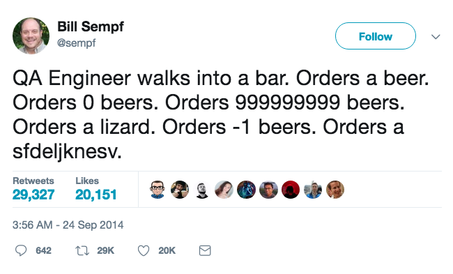
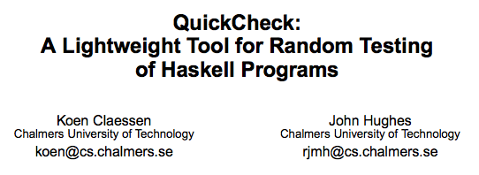
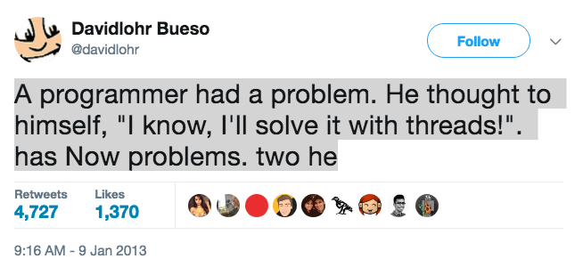

class: center, bottom, heading-black
background-image: url(images/example-based.jpeg)

# Finding More Bugs With Less Effort

## @charlesofarrell

???

- Property-based testing is our default
- We have a majority of property-based tests

---

class: center, bottom, heading-black
background-image: url("images/chopsticks.jpg")

## @charlesofarrell

???

- Property-based testing is our default
- We have a majority of property-based tests


---

class: center, middle, heading-black
background-image: url(images/goal.jpeg)

## Motivation?

???

- Safety
- At Ambiata it costs $$$

---

class: center, middle, heading-black
background-image: url(images/example-based.jpeg)

## Example-based Testing

---

class: code

```scala
def reverse[A](l: List[A]): List[A]
```

???

- The "Hello World" of property based testing

---

class: code

```scala
def reverse[A](l: List[A]): List[A]

def testReverse = {
  reverse(List(1, 2, 3)) == List(3, 2, 1)


}
```

---

class: code

```scala
def reverse[A](l: List[A]): List[A]

def testReverse = {
  reverse(List(1, 2, 3)) == List(3, 2, 1)
  reverse(List()) == List()

}
```

---

class: code

```scala
def reverse[A](l: List[A]): List[A]

def testReverse = {
  reverse(List(1, 2, 3)) == List(3, 2, 1)
  reverse(List()) == List()
  reverse(List(1, 1, 3)) == List(3, 1, 1)
}
```

---

class: middle, center




---

class: middle, center



???

- Year 2000!

---

class: middle, center


---

class: middle, center


---

class: center


http://www.quviq.com/volvo-quickcheck/

---

- 3,000 pages of specifications
- 20,000 lines of QuickCheck
- 1,000,000 LOC, 6 suppliers
- 200 problems
- 100 problems in the standard

---

class: middle, center

### https://en.wikipedia.org/wiki/QuickCheck

> 31 Languages

---

class: code, middle, center

```scala
println("Hello World")
```

---

class: code

```scala
def reverse[A](l: List[A]): List[A]

def testReverse =

    reverse(?) == ???
```

---

class: code

<pre><code class="scala scala-fg">&nbsp;


  forAll (???)


def forAll[A](Gen[A], A => Prop): Prop
</code></pre>

```scala-bg
def reverse[A](l: List[A]): List[A]

def testReverse =
  forAll (???)             { l =>
    reverse(l) == ???
  }

def forAll[A](Gen[A], A => Prop): Prop
```

---

class: code

<pre><code class="scala scala-fg">&nbsp;


          genList(???)


def genList[A](Gen[A]): Gen[List[A]]
</code></pre>

```scala-bg
def reverse[A](l: List[A]): List[A]

def testReverse =
  forAll (genList(???))    { l =>
    reverse(l) == ???
  }

def forAll[A](Gen[A], A => Prop): Prop

def genList[A](Gen[A]): Gen[List[A]]
```

---

class: code

<pre><code class="scala scala-fg">&nbsp;


                  genInt


def genInt: Gen[Int]
</code></pre>

```scala-bg
def reverse[A](l: List[A]): List[A]

def testReverse =
  forAll (genList(genInt)) { l =>
    reverse(l) == ???
  }

def forAll[A](Gen[A], A => Prop): Prop

def genList[A](Gen[A]): Gen[List[A]]

def genInt: Gen[Int]
```

---

class: code

```scala
def reverse[A](l: List[A]): List[A]

def testReverse =
  forAll (genList(genInt)) { l =>
    reverse(l) == ???
  }
```

---

class: code

```scala
def reverse[A](l: List[A]): List[A]

def testReverse =
  forAll (genList(genInt)) { l =>
    reverse(reverse(l)) == l
  }
```

---

class: code

```scala
def reverse[A](l: List[A]): List[A]

def testReverse =
  forAll (genList(genInt)) { l =>
    reverse(reverse(l)) == l
  }
```

<pre><code class="warning">
+ testReverse: OK, passed 100 tests.
</code></pre>

---

class: code

```scala
def reverse[A](l: List[A]): List[A]

def testReverse =
  forAll (genList(genInt)) { l =>
    reverse(reverse(l)) == l
  }
```

<pre><code class="warning">
List()
List(2147483647, 1)
List(-2147483648, 1, -1094275287)
List(6569, 2147, 14801, 0, 1852, -9217, 0)
</code></pre>


---

class: code

```scala
def reverse[A](l: List[A]): List[A]

def testReverse =
  forAll (genList(genInt)) { l =>
    reverse(l) == ???
  }
```

<pre><code class="warning">
1. Property Testing
2. ???
3. Profit
</code></pre>

---

- TODO Show writing original function


---

class: center


???

- Patterns
- Not just writing list sorting functions
- Can be hard to get started


---

class: middle, center

## Round-trip


---

class: code

```scala
def toBytes(s: String): Array[Byte]

def fromBytes(b: Array[Bytes]): String
```

---

class: code

```scala
def toBytes(s: String): Array[Byte]

def fromBytes(b: Array[Bytes]): String


forAll(genString) { s =>
  val b = toBytes(s)
  fromBytes(b) == s
}
```

---

class: code

```scala
def toBytes(s: String): Array[Byte]

def fromBytes(b: Array[Bytes]): String


forAll(genString) { s =>
  val b = toBytes(s)
  fromBytes(b) == s
}
```

<pre><code class="warning">"돪" != "?"

> ARG_0: "돪"
</code></pre>

---

class: center, middle, heading-white
background-image: url(images/learning.jpeg)

---

class: code

```scala
def toJson(user: User): Json

def fromJson(json: Json): Option[User]
```

---

class: code

```scala
def toJson(user: User): Json

def fromJson(json: Json): Option[User]


forAll(genUser) { user =>

  val json = toJson(user)
  fromJson(json) == Some(user)
}
```

---

class: code

```scala
def toJson(user: User): Json

def fromJson(json: Json): Option[User]


forAll(genUser) { user =>

  val json = toJson(user)
  fromJson(json) == Some(user)
}
```

- TODO TODO AESON


---

class: code

```scala
def insertUser(u: User): UserId

def getUser(u: UserId): Option[User]
```

---

class: code

```scala
def insertUser(u: User): UserId

def getUser(u: UserId): Option[User]


forAll(genUser) { user =>

  val id = insertUser(user)
  getUser(id) == Some(user)
}
```

---

class: code

```scala
def insertUser(u: User): UserId

def getUser(u: UserId): Option[User]


forAll(genUser) { user =>

  val id = insertUser(user)
  getUser(id) == Some(user)
}
```

<pre><code class="warning">Some(User(\NULL)) != Some(User())
</code></pre>

---

background-image: url(images/learning.jpeg)


---

class: middle, center

## Test Oracle


---

class: code

```scala
def timSort(l: List[Int]): List[Int]
```

---

class: code

```scala
def timSort(l: List[Int]): List[Int]


forAll(genList(genInt)) { l =>

  timSort(l) == bubbleSort(l)
}
```

---

class: code

```scala
def timSort(l: List[Int]): List[Int]


forAll(genList(genInt)) { l =>

  timSort(l) == bubbleSort(l)
}
```

<pre><code class="warning">
https://bugs.openjdk.java.net/browse/JDK-8072909

TimSort fails with ArrayIndexOutOfBounds
on worst case long arrays
</code></pre>

---

class: code

```scala
case class Date(value: Int)


def toJoda(date: Date): JodaDate

def fromJoda(date: JodaDate): Date
```

---

class: code

```scala
case class Date(value: Int)


def toJoda(date: Date): JodaDate

def fromJoda(date: JodaDate): Date


forAll(genDate) { d =>

  d.toJoda.fromJoda == d
}
```

---

class: code

```scala
def dayPlus(d: Date, i: Int): Date = {
  ...
}
```

---

class: code

```scala
def dayPlus(d: Date, i: Int): Date = {
  ...
}

forAll(genDate) { d =>
forAll(genInt) { i =>

  dayPlus(d, i) ==
    d.toJoda.plusDays(i).fromJoda
}}
```

---

class: code

```scala
def dayPlus(d: Date, i: Int): Date = {
  ...
}

forAll(genDate) { d =>
forAll(genInt) { i =>

  dayPlus(d, i) ==
    d.toJoda.plusDays(i).fromJoda
}}
```

<pre><code class="warning">Date(2004,2,29) != Date(2004,3,1)

ARG_0: Date(2004,2,28)
ARG_1: 1
</code></pre>

---

class: center, middle, section-aqua, heading-white
background-image: url(images/property-based.jpeg)

---

class: code

```scala
def listUsersSortByName: List[User] =
  "SELECT * FROM user ORDER BY name ASC"
```

---

class: code

```scala
def listUsersSortByName: List[User]


forAll(genList(genUser)) { users =>

  users.foreach(u => insertUser(u))

  val l = listUsersSortByName

  l == users.sortBy(_.name.toLowerCase)
}
```

---

class: code

```scala
def findUsersByPostCode(code: Int): List[User] =
  "SELECT * FROM user WHERE postcode = ?"
```

---

class: code

```scala
def findUsersByPostCode(code: Int): List[User]

forAll(genPostcode) { postcode =>
forAll(genList(genUser)) { users =>


  val has = users.filter(_.postcode == postcode)


  users
    .foreach(u => userDb.insert(u))

  userDb.findUsersByPostCode(postcode) == has
}}
```

???

- God forbid you're not using prepared statements
  this would find a bug pretty quick

---

class: code

```scala
def findByPostCode(postcode: Int): List[User]

forAll(genPostcode) { postcode =>
forAll(genList(genUser)) { u1 =>
forAll(genList(genUser)) { u2 =>

  val has = u1.map(_.copy(postcode = postcode))

  val not = u2.filter(_.postcode != postcode)

  (has ++ not)
    .foreach(u => userDb.insert(u))

  userDb.findByPostCode(postcode) == has
}}}
```


---

class: center, middle

## Idempotence


---

class: code

```scala
forAll(genList(genInt)) { s =>

  l.sorted.sorted == l.sorted
}
```

---

class: code

```scala
def createOrUpdateUser(u: User): UserId

forAll(genUser) { u =>

  val r1 = createOrUpdateUser(u)

  val r2 = createOrUpdateUser(u)

  r1 == r2
}
```


---

class: center, middle, section-aqua, heading-white

## Invariants

???

- Need to be combined with multiple properties
  to test the entire function

---

class: code

```scala
forAll(genString) { s =>
  s.toLowerCase.length == s.length
}
```

---

class: code

```scala
forAll(genString) { s =>
  s.toLowerCase.length == s.length
}
```

<pre><code class="warning">
Expected 2 but got 1
ARG_0: "İ"
</code></pre>


---

class: right, bottom, heading-white
background-image: url(images/shrink.jpeg)

## Shrinking


---

class: code

```scala
forAll(genString) { s =>
  s.toLowerCase.length == s.length
}
```

<pre><code class="warning">
! testLowerCase: Falsified after 89 passed tests.

Expected 15 but got 14
ARG_0: "()*@#%KFPSDlİDcx;lk1&(#"
</code></pre>

---

class: code

```scala
forAll(genString) { s =>
  s.toLowerCase.length == s.length
}
```

<pre><code class="warning">
! testLowerCase: Falsified after 89 passed tests.

Expected 2 but got 1
ARG_0: "İ"
ARG_0_ORIGINAL: "()*@#%KFPSDlİDcx;lk1&(#"
</code></pre>


---

class: bottom, right, heading-white
background-image: url(images/state-based.jpeg)

## State-based Testing

???

- "State of the art"
- Unit test vs integration testing
- Generate the whole test

---

## State-based Testing

1. Describe the possible states
2. Describe what actions can take place in each state
3. Describe how to tell if the state is correct
4. Have the computer try lots of random actions – look for a breaking combination

---

class: code

```scala
def insertUser(u: User): UserId

def getUser(i: UserId): Option[User]
```

---

class: code

```scala
case class State(users: Map[UserId, User])
```

---

class: code

```scala
case class State(users: Map[UserId, User])

case class Insert(u: User) extends Commands
```

---

class: code

```scala
case class State(users: Map[UserId, User])

case class Insert(u: User) extends Commands {

  def nextState(state: State, id: UserId): State =
    state + (id -> u)

  def preCondition(state: State): Boolean =
    true

  def run: UserId =
    insertUser(u)
}
```

---

class: code

```scala
case class State(users: Map[UserId, User])

case class Insert(u: User) extends Commands

case class Get(u: UserId) extends Commands
```

---

class: code

```scala
case class State(users: Map[UserId, User])

case class Insert(u: User) extends Commands

case class Get(u: UserId) extends Commands

def genCommand: Gen[Command] =
  genOneOf(Insert, Get)
```

---

class: code

```scala
case class State(users: Map[UserId, User])

case class Insert(u: User) extends Commands

case class Get(u: UserId) extends Commands

def genCommand: Gen[Command] =
  genOneOf(Insert, Get)
```

<pre><code class="warning">
ARG_0: Actions(List(Insert, Insert, Get))
</code></pre>

---

class: code

```scala
case class State(users: Map[UserId, User])

case class Insert(u: User) extends Commands

case class Get(u: UserId) extends Commands

def genCommand: Gen[Command] =
  genOneOf(Insert, Get)
```

<pre><code class="warning">
ARG_0: Actions(List(Insert, Insert, Get))
ARG_0_ORIGINAL: Actions(List(Insert, Insert, Get, Get, Insert, Get))
</code></pre>

---

class: middle, center



---

class: code

```scala
trait Commands {

  def property(threadCount: Int): Prop
}
```

---

class: center, middle


> Poolboy had 85% test coverage (and most of the remaining 15% was irrelevant boilerplate) when I started QuickChecking it, and I felt pretty happy with its solidity, so I didn’t expect to find many bugs, if any. I was very wrong.

http://basho.com/posts/technical/quickchecking-poolboy-for-fun-and-profit/

---

class: middle, center


http://www.quviq.com/google-leveldb/


???

- LevelDB is a fast key-value storage C++ library written at Google that
  provides an ordered mapping from string keys to string values.

---

class: code, thinner

```sh
1. open new database
2. put key1 and val1
3. close database
4. open database
5. delete key2
6. delete key1
7. close database
4. open database
5. delete key2
6. delete key1
7. close database
11. open database
12. put key3 and val1
13. close database
14. open database
15. close database
16. open database
17. seek first
```

???

- 17 steps.
- THEN 33 steps

https://groups.google.com/forum/#!topic/leveldb/gnQEgMhxZAs

- Was in 2013


---

class: center, middle, section-aqua, heading-white

## Fuzzing

---

class: code

```scala
def testUser = {


    val user = User("bob", 2000)

    insertUser(user)
}
```

---

class: code

```scala
def testUser = {
  forAll(genString) { name =>
  forAll(genInt) { postcode =>

    val user = User(name, postcode)

    insertUser(user)
}}}
```

---

class: code


```scala
def testUser = {
  forAll(genString) { name =>
  forAll(genInt) { postcode =>

    val user = User(name, postcode)

    insertUser(user)
}}}
```

<pre><code class="warning">
! testUser: Falsified after 21 passed tests.
NullPointerException
> ARG_0: ""
> ARG_1: 0
</code></pre>

---

class: center, middle, heading-white
background-image: url(images/generators.jpeg)

## Generators

???

- Investment!

---

class: middle, center


???

## True Story - "null" username

---

class: code

```scala
def testMigrateUser =


    migrateUser("bob")


def testNullUsername =
  migrateUser("null")
```

???

- Only tests one code-path

---

class: code

```scala
def testMigration =
  forAll(genUsername) { u =>

    migrateUser(u)
  }

def genUsername: Gen[String] =

          genList(genAlphaNum)
```

???

- Ideally you don't have to add any more tests

---

class: code

<pre><code class="scala scala-fg">&nbsp;


  genFrequency(

    1  -> genConst("null")
  )
</code></pre>

```scala-bg
def testMigration =
  forAll(genUsername) { u =>

    migrateUser(u)
  }

def genUsername: Gen[String] =
  genFrequency(
    19 -> genList(genAlphaNum)
  , 1  -> genConst("null")
  )
```

---

class: code

```scala
def testMigration =
  forAll(genUsername) { u =>

    migrateUser(u)
  }

def testInsert =
  forAll(genUsername) { u =>

    insertUser(u)
  }
```


---

class: bottom, left, heading-white
background-image: url(images/hunt.jpeg)

## Bug hunting

---

class: top, center

> "Maybe you could test a relatively well known open source library and find a
bug for something they have unit tests for" [@markhibberd](https://twitter.com/markhibberd)

---

class: top, center

> "Maybe you could test a relatively well known open source library and find a
bug for something they have unit tests for" [@markhibberd](https://twitter.com/markhibberd)


---

class: code

```scala
import org.joda.time._


forAll(genDate) { dt =>

  val formatter = DateTimeFormat.fullDateTime()

  val s = formatter.print(dt)
  formatter.parseDateTime(s) == dt
}
```

???

- Symmetrical

---

class: code

```scala
import org.joda.time._


forAll(genDate) { dt =>

  val formatter = DateTimeFormat.fullDateTime()

  val s = formatter.print(dt)
  formatter.parseDateTime(s) == dt
}
```

<pre><code class="warning">Invalid format:
"Sunday, September 22, 2148 9:08:08 PM ART"
is malformed at "ART"
</code></pre>

---

## Bug or Feature?

- http://stackoverflow.com/questions/15642053/joda-time-parsing-string-throws-java-lang-illegalargumentexception
- http://comments.gmane.org/gmane.comp.java.joda-time.user/1385
- https://github.com/JodaOrg/joda-time/commit/14863a51230b3d44201646dbc1ce5d7f6bb97a33

---

class: image, middle

<a href="https://twitter.com/da_terry/status/587602658011189252">
  
</a>

---

class: code

```scala
import org.rauschig.jarchivelib._


def archiveProp(archiver: Archiver): Prop =

  forAll(genFiles) { files =>

    val archive = archiver.create(files)
    archive.loadAll() == files
  }
```

???

- Symmetrical

---

class: code

```scala
import org.rauschig.jarchivelib._


def archiveProp(archiver: Archiver): Prop =

  forAll(genFiles) { files =>

    val archive = archiver.create(files)
    archive.loadAll() == files
  }

archiveProp(createArchiver(Jar, PACK200))
```

<pre><code class="warning">Expected "" but got "PKPACK2000"
</code></pre>

---

class: code

```scala
import org.rauschig.jarchivelib._


def archiveProp(archiver: Archiver): Prop =

  forAll(genFiles) { files =>

    val archive = archiver.create(files)
    archive.loadAll() == files
  }

archiveProp(createArchiver(Tar))
```

<pre><code class="warning">file name '...' is too long (> 100 bytes)
</code></pre>

---

class: code

```scala
import org.rauschig.jarchivelib._


def archiveProp(archiver: Archiver): Prop =

  forAll(genFiles) { files =>

    val archive = archiver.create(files)
    archive.loadAll() == files
  }

archiveProp(createArchiver(Ar))
```

<pre><code class="warning">Expected "aⲐ" "a?"
</code></pre>


---

class: center, middle, heading-black
background-image: url(images/goal.jpeg)

## Motivation

---

class: center, middle, heading-black
background-image: url(images/example-based.jpeg)

## Example-based Testing

---

class: center, middle, section-aqua, heading-white
background-image: url(images/property-based.jpeg)

## Property-based Testing

???

## One Property / Many Bugs

---

class: center, middle, heading-white
background-image: url(images/learning.jpeg)

## Learning

---

class: center, middle, heading-white


---

class: right, bottom, heading-white
background-image: url(images/shrink.jpeg)

## Shrinking

---

class: bottom, right, heading-white
background-image: url(images/state-based.jpeg)

## State-based Test

---

class: center, middle, heading-white
background-image: url(images/generators.jpeg)

## Generators

---

class: middle, center

### https://en.wikipedia.org/wiki/QuickCheck

> 31 Languages

???

- No longer feels like you're writing tests for test sake
- Enjoyable tot think about your system invariants

---

## Links

- "Choosing properties for property-based testing"
  - http://fsharpforfunandprofit.com/posts/property-based-testing-2/
- John Hughes - "Testing the Hard Stuff and Staying Sane"
  - https://www.youtube.com/watch?v=zi0rHwfiX1Q
- Alex Chan - "Property-based Testing in Practice"
  - https://www.infoq.com/presentations/hypothesis-afl-property-testing
- [@charlesofarrell](https://twitter.com/charlesofarrell)
  - https://github.com/charleso/property-testing-preso
